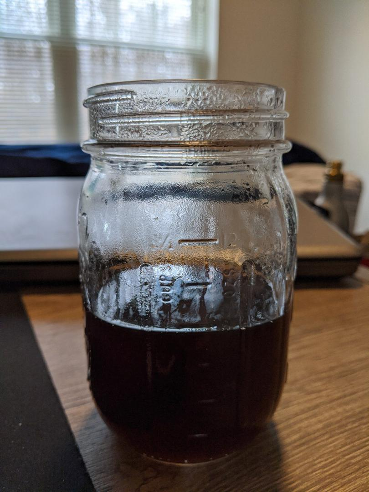
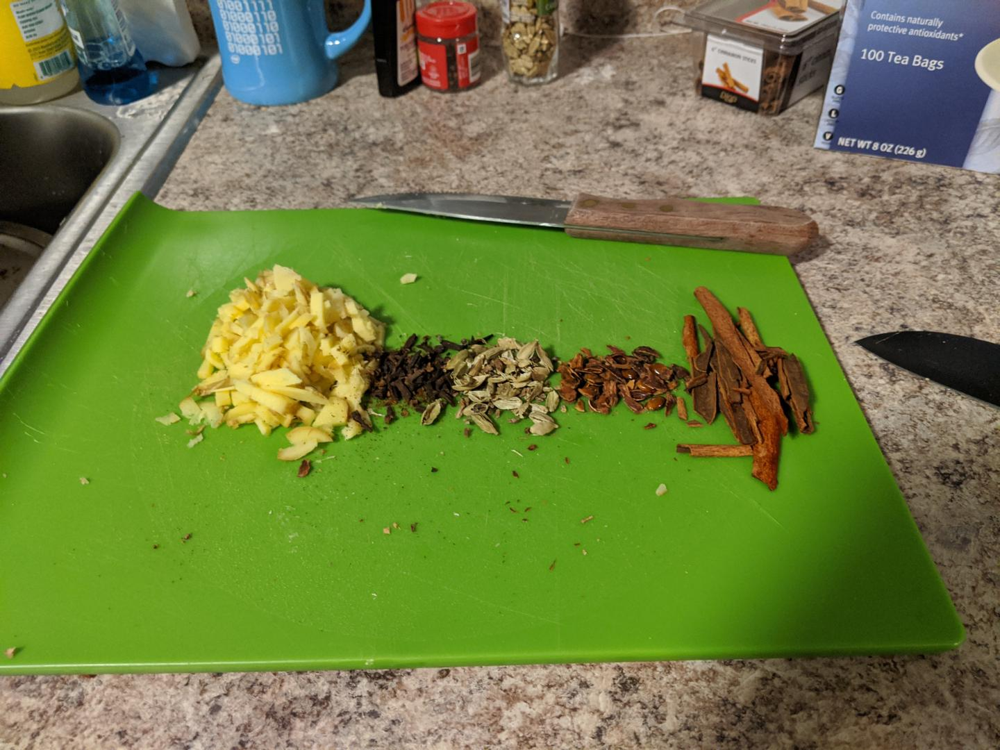

A chai tea mix named after its refiner, [Andy Meyer](https://andymeyer.xyz/).

<!--more-->



Some notes on sweetening:
* Milk will add some sweetness; you might want to under-sweeten before adding milk
  * A couple popular combinations according to Andy are 50-50 milk-chai, and using heavy cream or half-and-half instead.
* If using vanilla extract, add immediately before drinking or else it'll evaporate

Experiment! The recipe, as defined by Andy, is not exact.
You may prefer more or less of some things.

